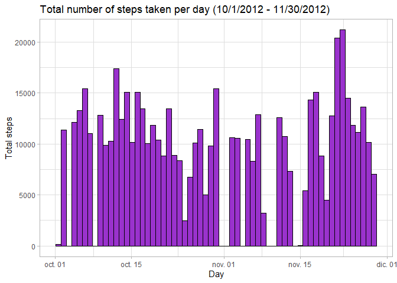
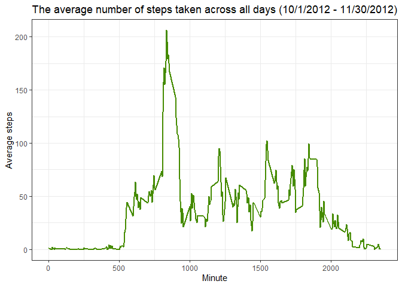
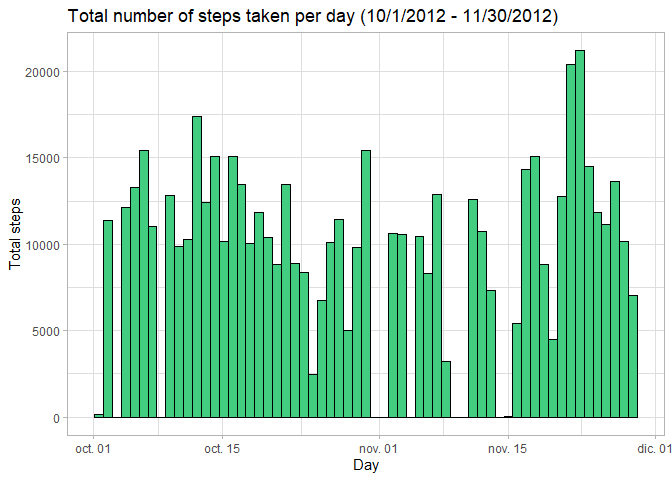
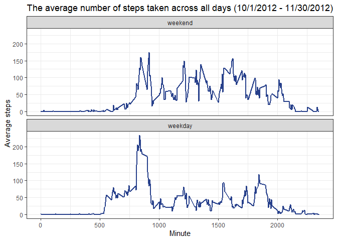

## Loading and preprocessing the data

```r
unzip("activity.zip", exdir = "./data")
activity <- read.csv("./data/activity.csv", stringsAsFactors = FALSE)
activity$date <- as.Date(activity$date, format = "%Y-%m-%d")
```


## What is mean total number of steps taken per day?

```r
library(dplyr)
library(ggplot2)
steps.day <- activity %>% 
  group_by(date) %>%
  summarise(total = sum(steps, na.rm = TRUE))

steps.frequency <- rep(steps.day$date, times=steps.day$total)
n.bins <- length(steps.day$date)

ggplot() + 
  geom_histogram(aes(steps.frequency), bins = n.bins, fill = "darkorchid3", col = "black") +
  theme_light() +
  labs(x="Day", y="Total steps", title="Total number of steps taken per day (10/1/2012 - 11/30/2012)")
```

<!-- -->

Total number of steps taken per day

Mean:

```r
mean.steps <- mean(steps.day$total)
mean.steps
```

```
## [1] 9354.23
```
Median:

```r
median.steps <- median(steps.day$total)
median.steps
```

```
## [1] 10395
```

## What is the average daily activity pattern?

```r
steps.interval <- activity %>% 
  group_by(interval) %>%
  summarise(avg = mean(steps, na.rm = TRUE))

ggplot(steps.interval, aes(x=interval, y=avg)) +
  geom_line(size=1, col="chartreuse4") +
  theme_bw() +
  labs(x="Minute", y="Average steps", title="The average number of steps taken across all days (10/1/2012 - 11/30/2012)")
```

<!-- -->

Which 5-minute interval, on average across all the days in the dataset, contains the maximum number of steps?

```r
max.index <- which(steps.interval$avg == max(steps.interval$avg))
steps.interval$interval[max.index]
```

```
## [1] 835
```


## Imputing missing values
Total number of rows with NAs

```r
nrow(activity[rowSums(is.na(activity)) > 0,])
```

```
## [1] 2304
```

Filling in all of the missing values in steps column.

```r
activity2 <- activity %>% group_by(date) %>% mutate(steps = case_when(
  is.na(steps) ~  as.integer(mean(steps, na.rm = TRUE)), 
  TRUE ~ steps))

activity2 <- activity2 %>% group_by(date) %>% mutate(steps = case_when(
  is.na(steps) ~ as.integer(0), 
  TRUE ~ steps))
```

Dates were found where all steps records are NA therefore a second na replacement was written.

Filling in all of the missing values in interval column.

```r
length(which(is.na(activity$interval)))
```

```
## [1] 0
```

No NAs were found in the interval column


```r
steps.day <- activity2 %>%
  summarise(total = sum(steps))

steps.frequency <- rep(steps.day$date, times=steps.day$total)
n.bins <- length(steps.day$date)

ggplot() + 
  geom_histogram(aes(steps.frequency), bins = n.bins, fill = "seagreen3", col = "black") +
  theme_light() +
  labs(x="Day", y="Total steps", title="Total number of steps taken per day (10/1/2012 - 11/30/2012)")
```

<!-- -->

Total number of steps taken per day

Mean:

```r
mean(steps.day$total)
```

```
## [1] 9354.23
```
Median:

```r
median(steps.day$total)
```

```
## [1] 10395
```
## Are there differences in activity patterns between weekdays and weekends?

```r
library(timeDate)
activity <- activity %>% mutate(weekDay = factor(isWeekday(date), levels = c(FALSE,TRUE), labels = c("weekend", "weekday"))) 

steps.interval <- activity %>% 
  group_by(weekDay, interval) %>%
  summarise(avg = mean(steps, na.rm = TRUE))
```

```
## `summarise()` has grouped output by 'weekDay'. You can override using the `.groups` argument.
```

```r
ggplot(steps.interval, aes(x=interval, y=avg)) +
  geom_line(size=1, col="royalblue4") +
  facet_wrap(weekDay ~ ., nrow = 2, ncol = 1) +
  theme_bw() +
  labs(x="Minute", y="Average steps", title="The average number of steps taken across all days (10/1/2012 - 11/30/2012)")
```

<!-- -->

